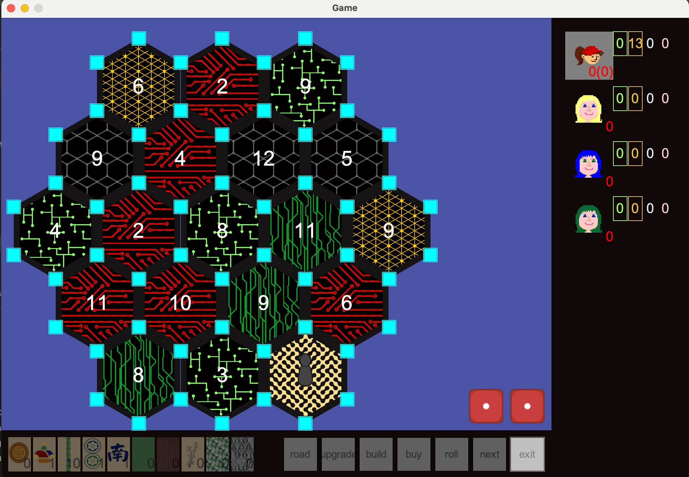
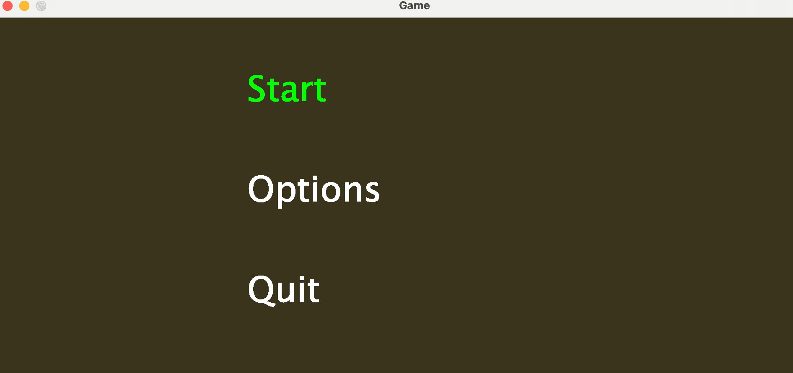

# Catan Clone (Java)  
This is a clone of the famous board game **Settlers of Catan**, implemented in Java.
Ui is made using swing. everything is drawn on a canvas each frame.

  


## How to Play  

When it is your turn u can roll the dice. and then make the action you deem best.
each action is represented by a button. when the action is possible, the button
will be highlighted otherwise it is dim.

### Navigation  
- **↑ ↓ → ←** to move between options  
- **Enter** to confirm  

  

### Running the Game  
```bash
java -jar catan.jar
```

or u can just rebuild it and run it with intellij.